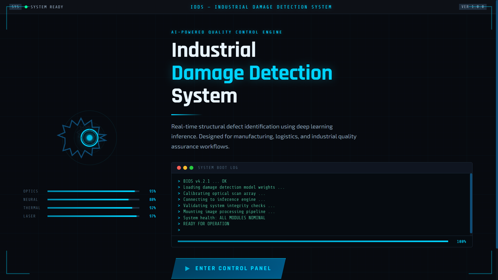
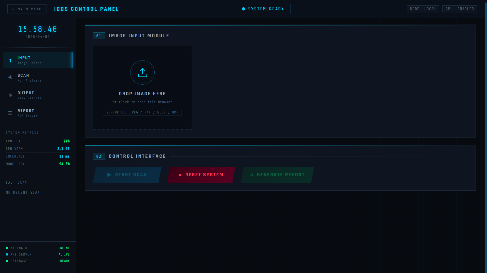
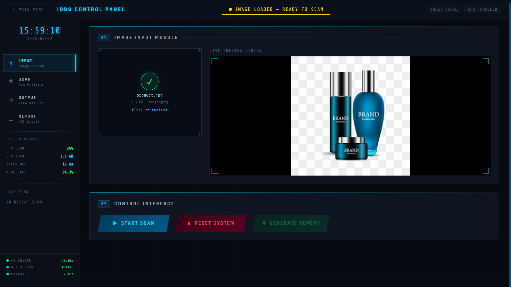
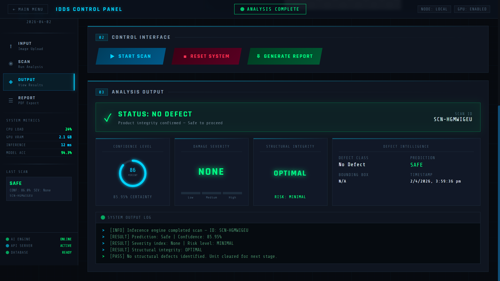
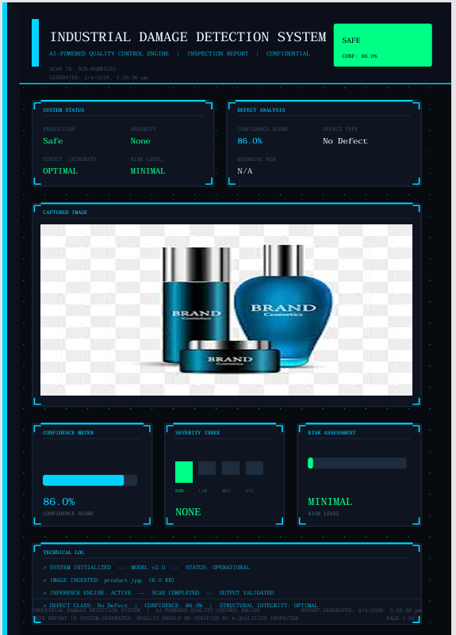

# Industrial Damage Detection System (IDDS)

An AI-powered industrial quality inspection system that detects product damage using deep learning and presents results through a futuristic factory control panel interface.

---

## Overview

The Industrial Damage Detection System (IDDS) automates product inspection by analyzing images and identifying defects such as scratches, fractures, and structural damage.

It replaces manual inspection with an intelligent, scalable, and explainable AI system, improving accuracy, speed, and reliability.

---

## Key Features

* AI-based damage detection
* Confidence scoring and severity analysis
* Plug-and-play ML model integration
* Bounding box and heatmap visualization
* Automated PDF report generation
* FastAPI backend for real-time inference
* React frontend with industrial UI
* Simulation mode (works without model)

---

## System Interface

### Landing Page

Industrial boot-style interface with system initialization visuals

### Control Panel

* Image upload and preview
* Scan execution system
* Real-time system metrics

### Analysis Output

* Damage status (Safe / Defect Detected)
* Confidence level
* Severity classification
* Structural integrity assessment

### Report Generation

* Downloadable inspection report
* Includes prediction, metrics, and image

---

## AI Model Integration

The system supports plug-and-play model integration.

### Current Mode

* Simulation mode (no model required)

### Upgrade to Real Model

1. Train model (Google Colab)
2. Export weights:
   damage_model.pth
3. Place file:
   backend/models/damage_model.pth
4. Restart backend

The system will automatically switch to real inference.

---

## Tech Stack

### Frontend

* React (Vite)
* Tailwind CSS
* Framer Motion

### Backend

* FastAPI
* Python

### AI/ML

* PyTorch (MobileNet / CNN)

---

## Project Structure

```
damage-detection/
├── backend/
│   ├── main.py
│   ├── routes/
│   ├── services/
│   ├── models/
│   │   ├── damage_model.py
│   │   └── damage_model.pth (ignored)
│   └── utils/
│
├── frontend/
│   ├── src/
│   │   ├── pages/
│   │   ├── components/
│   │   └── services/
│
└── README.md
```

---

## How to Run

### Backend

```
cd backend
pip install -r requirements.txt
uvicorn main:app --reload
```

### Frontend

```
cd frontend
npm install
npm run dev
```

### Open Application

```
http://localhost:5173
```

---

## API Endpoint

POST /api/predict

Input: Image file

Output:

```
{
  "prediction": "Damaged / Safe",
  "confidence": 0.86,
  "severity": "Low / Medium / High",
  "bounding_box": [x, y, w, h],
  "damage_type": "scratch / fracture",
  "heatmap": "base64"
}
```

---


## Screenshots

### Landing Page


### Analysis Output



### Dashboard


### Report


---

## Author

Riddhi Poddar
B.Tech CSE (Data Science)

---

## Final Note

This project demonstrates how AI can transform industrial quality control through automation, explainability, and real-time decision-making.
